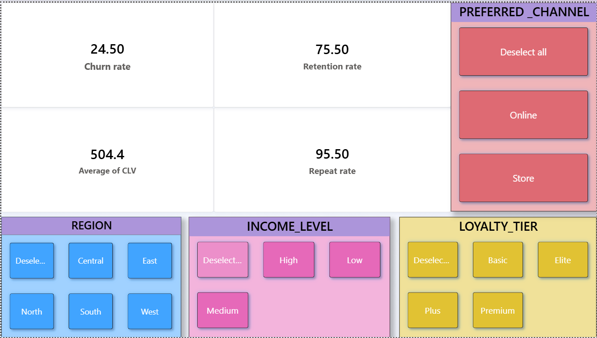
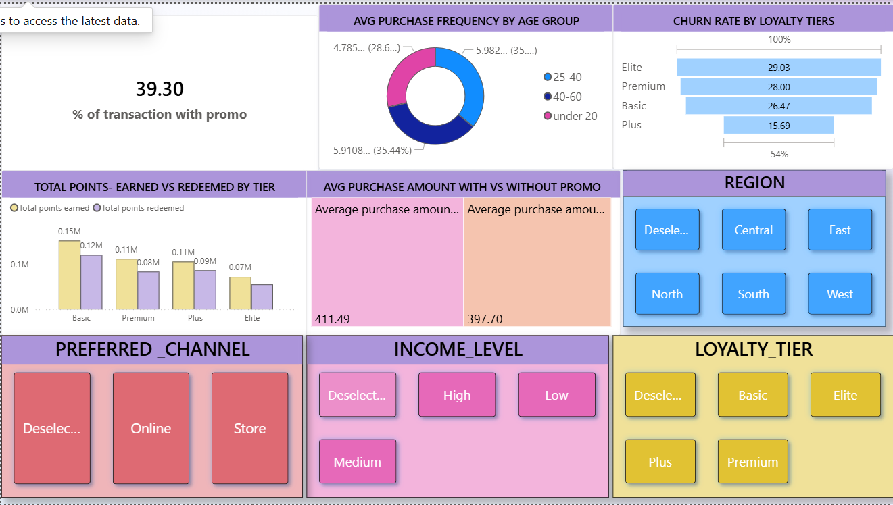
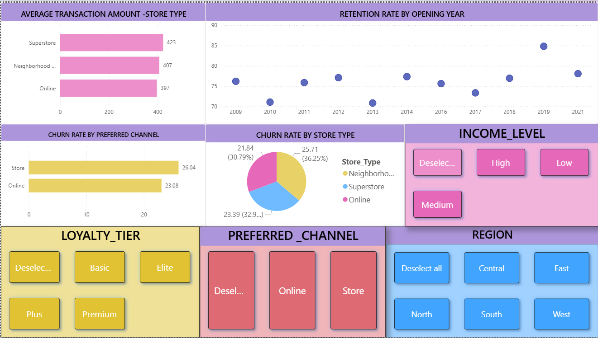
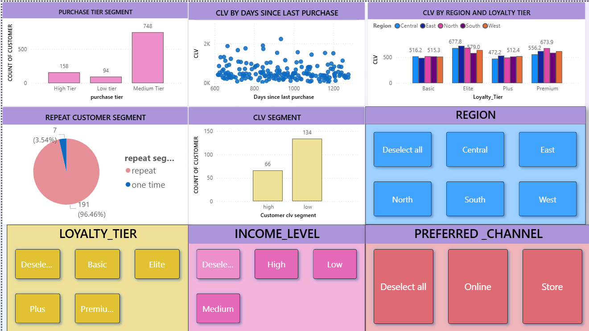

# 🛒 Retail Customer Retention Analytics | Power BI

## 📌 Project Overview

This project focuses on analyzing customer retention for Target Corporation using Power BI. The objective is to identify customer churn patterns, evaluate loyalty program effectiveness, analyze customer lifetime value (CLV), and provide actionable recommendations to improve customer retention and business performance.

The project combines customer demographics, transaction history, loyalty program data, and store information to build an interactive multi-page dashboard for business decision-making.

---

## 🎯 Business Problem

Customer retention is one of the most important factors affecting retail profitability. This project aims to answer questions such as:

- Which customers should be prioritized for retention?
- How effective are promotional campaigns?
- Which loyalty tiers have the highest churn?
- Which sales channels are underperforming?
- How can Target improve customer loyalty and retention?

---

## 🛠️ Tools & Technologies

- Microsoft Power BI
- Power Query
- DAX (Data Analysis Expressions)
- Data Modeling
- Data Visualization

---

## 📊 Dashboard Features

### Page 1 – Customer KPIs
- Customer Churn Rate
- Customer Lifetime Value (CLV)
- Repeat Purchase Rate
- Retention Rate

### Page 2 – Loyalty & Promotion Analysis
- Promotion Effectiveness
- Average Transaction Amount
- Loyalty Points Earned vs Redeemed
- Churn by Loyalty Tier

### Page 3 – Store & Channel Analysis
- Average Transaction by Store Type
- Churn by Store Type
- Retention by Store Opening Year
- Channel-wise Performance

### Page 4 – Customer Segmentation
- Customer Lifetime Value Segmentation
- Repeat vs One-Time Customers
- High Value Customers
- Days Since Last Purchase Analysis

---

## 📈 Key Business Insights

- Promotion usage was significantly lower than expected.
- Elite loyalty customers showed a higher churn rate.
- Offline store channels experienced higher churn compared to online channels.
- High-CLV inactive customers should be prioritized for retention campaigns.
- Loyalty point redemption can be improved through better reward strategies.

---

## 💡 Business Recommendations

- Improve promotion accessibility to increase adoption.
- Launch exclusive offers for high-value customers.
- Simplify loyalty point redemption.
- Improve the in-store shopping experience.
- Focus retention campaigns on inactive high-CLV customers.

---

## 📷 Dashboard Preview

---

## 🚀 Skills Demonstrated

- Data Cleaning
- Data Modeling
- Power Query
- DAX
- Customer Segmentation
- Churn Analysis
- Customer Lifetime Value (CLV)
- Business Intelligence
- Interactive Dashboard Design

---

## 👩‍💻 Author

**Vritika Singh**

Aspiring Data Analyst | Data Scientist

**Skills:** Excel • Power BI • SQL • Python • Machine Learning
